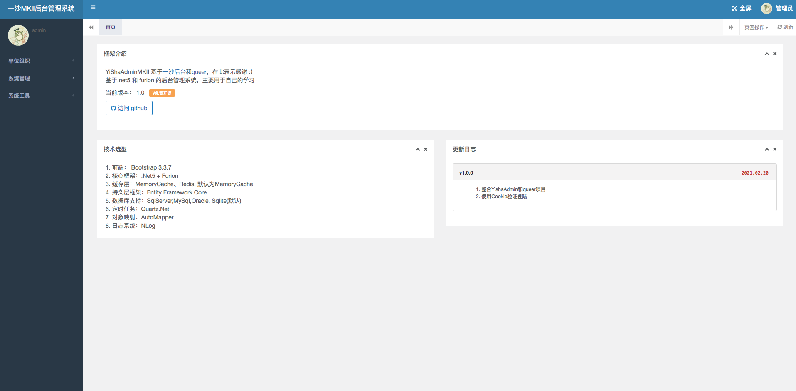
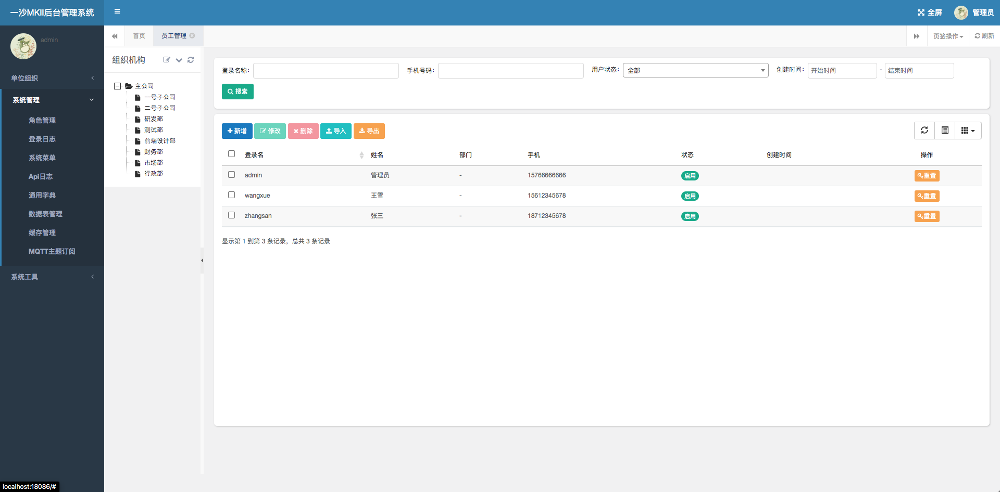

# queer

#### 介绍

YiShaAdminMKII 基于[一沙后台](https://github.com/liukuo362573/YiShaAdmin)和[queer](https://gitee.com/songzhidan/queer)，在此表示感谢 :）
1. 基于.net5 和 furion 的后台管理系统，主要用于自己的学习
2. 项目尚未完善，仅用于自己的学习，不喜互喷
3. 已完成功能：权限验证、用户管理、角色管理、菜单管理、日志记录、缓存管理
4. 使用框架：
  1. 前端： Bootstrap
  2. 核心框架：.Net5 + Furion
  3. 缓存层：MemoryCache、Redis, 默认为MemoryCache
  4. 持久层框架：Entity Framework Core
  5. 数据库支持：SqlServer,MySql,Oracle, Sqlite(默认)， 如需要使用其他数据库，请使用YiSha.Database.Migrations项目创建数据库
  6. 定时任务：Quartz.Net
  7. 对象映射：AutoMapper
  8. 日志系统：NLog
6. 如何运行：
    * clone本项目
    * cd YiSha.Web
    * dotnet run
    * 访问 http://localhost:18086/  账号 admin 密码 123456
    * 项目 Swagger地址 http://localhost:18086//api
7. 项目截图

